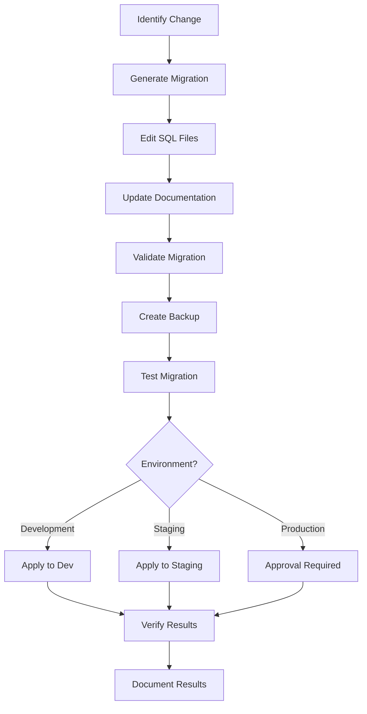

# Database Migrations System

## Overview

The Database Migrations System is a comprehensive, enterprise-grade solution for managing database schema changes across multiple services and environments. Built with PostgreSQL and golang-migrate, it provides automated migration generation, validation, dependency management, and environment-specific deployments.

**🚀 Migration Orchestrator**: For advanced use cases, the system includes a sophisticated **Migration Orchestrator** that provides intelligent dependency resolution, risk assessment, comprehensive tracking, and enterprise-grade migration management. See the [Migration Orchestrator guide](./orchestrator.md) for details.

## Key Features

- 🚀 **Automated Generation**: Create complete migrations with templates
- ✅ **Comprehensive Validation**: SQL syntax, dependencies, and structure checks
- 🌍 **Environment Awareness**: Different migrations for dev/staging/production
- 🔗 **Dependency Management**: Automatic dependency tracking and validation
- 📋 **Self-Documenting**: Auto-generated migration documentation
- 🛡️ **Production Ready**: Approval workflows, risk assessment, and safety checks
- 🔄 **Smart Rollback**: Safe rollback procedures with validation
- 💾 **Backup Integration**: Automated backup creation for safety

## Architecture

### Schema-per-Service Approach

```
service_db (PostgreSQL)
├── public
│   └── system tables
├── user_service
│   ├── user_service_schema_migrations (service-specific tracking)
│   ├── users
│   └── user-related tables
└── [future_service]
    ├── [service]_schema_migrations (service-specific tracking)
    └── service-specific tables
```

### Migration Structure

```
services/{service}/migrations/
├── README.md                          # Service-specific docs
├── dependencies.json                  # Migration dependencies
├── environments.json                  # Environment config
├── {NNNN}_{name}.up.sql              # Migration files
├── {NNNN}_{name}.down.sql
├── development/                       # Environment-specific
├── staging/
├── production/
├── docs/                             # Migration docs
└── templates/                        # Custom templates
```

## Quick Start

### 1. Generate a New Migration

```bash
# Generate a table migration (specify service)
make db-migration-generate NAME=add_user_profiles TYPE=table SERVICE_NAME=user-service

# Generate an index migration
make db-migration-generate NAME=optimize_user_queries TYPE=index SERVICE_NAME=user-service

# Generate a data migration
make db-migration-generate NAME=migrate_user_data TYPE=data SERVICE_NAME=user-service
```

### 2. Validate Migration

```bash
# Validate all migrations (specify service)
make db-validate SERVICE_NAME=user-service

# Check dependencies
make db-migration-deps SERVICE_NAME=user-service
```

### 3. Run Migrations

```bash
# Initialize orchestrator tracking (recommended for new services)
make db-migrate-init-orchestrator SERVICE_NAME=user-service

# Apply all pending migrations with orchestrator (enhanced features)
make db-migrate-up SERVICE_NAME=user-service

# Check comprehensive migration status
make db-migrate-status-orchestrator SERVICE_NAME=user-service

# Intelligent rollback with dependency checking
make db-migrate-down SERVICE_NAME=user-service
```

**Note**: The Migration Orchestrator provides enhanced features like dependency management, risk assessment, and comprehensive tracking. For basic golang-migrate functionality, use the standard commands. See [Migration Orchestrator](./orchestrator.md) for details.

### 4. Seed Data

```bash
# Basic seeding
make db-seed

# Environment-specific seeding
make db-seed-enhanced ENV=development
```

## Documentation Structure

- **[Migration Orchestrator](./orchestrator.md)**: Enterprise-grade migration management system
- **[Getting Started](./getting-started.md)**: Basic setup and first migration
- **[Migration Types](./migration-types.md)**: Different migration categories and templates
- **[Advanced Features](./advanced-features.md)**: Dependencies, environments, validation
- **[Best Practices](./best-practices.md)**: Guidelines and recommendations
- **[Troubleshooting](./troubleshooting.md)**: Common issues and solutions
- **[API Reference](./api-reference.md)**: Complete command reference
- **[Examples](./examples.md)**: Real-world migration examples

## Migration Workflow



## Environment Support

### Development
- Fast iteration and testing
- Development-specific test data
- Relaxed validation rules
- Safe to experiment

### Staging
- Mirrors production environment
- Pre-production validation
- Stricter validation rules
- Performance testing

### Production
- Strict approval workflows
- Backup requirements
- Maintenance windows
- Rollback safety checks

## Safety Features

- **Pre-flight Validation**: Syntax and dependency checks
- **Automatic Backups**: Before destructive operations
- **Dependency Resolution**: Prevents invalid migration order
- **Rollback Verification**: Ensures rollback safety
- **Environment Isolation**: Prevents cross-environment conflicts

## Integration Points

### CI/CD Pipeline
```yaml
# .github/workflows/migrations.yml
- name: Validate Migrations
  run: make db-validate

- name: Test Migrations
  run: make db-migrate-up

- name: Backup Database
  run: make db-backup
```

### Application Code
```go
// Repository automatically uses schema-qualified tables
func (r *UserRepository) Create(ctx context.Context, user *models.User) error {
    query := `INSERT INTO user_service.users (...)`
    // Implementation
}
```

## Monitoring & Alerting

- Migration execution time tracking
- Success/failure metrics
- Automated alerts for failures
- Historical execution logs
- Performance monitoring

## Contributing

1. Follow the established naming conventions
2. Always create both up and down migrations
3. Update dependencies.json for new migrations
4. Add comprehensive documentation
5. Test migrations in development environment
6. Validate with `make db-validate` before committing

## Support

- 📖 **[Getting Started](./getting-started.md)** for basic usage
- 🔧 **[Troubleshooting](./troubleshooting.md)** for common issues
- 💡 **[Best Practices](./best-practices.md)** for guidelines
- 📚 **[API Reference](./api-reference.md)** for complete commands

---

**Version**: 1.0.0
**Last Updated**: September 2025
**Compatibility**: PostgreSQL 15+, golang-migrate v4.15+