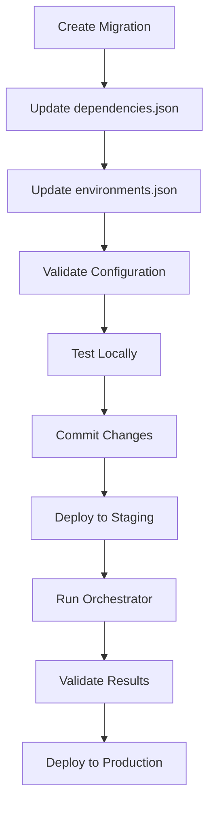

# Migration Orchestrator

## Overview

The **Migration Orchestrator** is an enterprise-grade enhancement to the basic golang-migrate system that provides intelligent migration management, dependency resolution, risk assessment, and comprehensive tracking for multi-service architectures.

### Why the Orchestrator Exists

While golang-migrate provides reliable database migrations, it lacks features needed for complex, multi-service environments:

- **No dependency management**: Migrations run in filename order only
- **No environment awareness**: Same migrations run everywhere
- **No risk assessment**: No warnings for high-impact changes
- **Limited tracking**: Basic version tracking without execution details
- **No rollback intelligence**: Simple step-based rollback without dependency checking

The orchestrator addresses these gaps while maintaining compatibility with existing golang-migrate workflows.

## Architecture

### Core Components

```
migration-orchestrator/
├── cmd/                    # CLI commands
│   ├── init.go            # Initialize tracking for new services
│   ├── up.go              # Run migrations up with intelligence
│   ├── down.go            # Intelligent rollback with dependency checking
│   ├── status.go          # Comprehensive status reporting
│   ├── list.go            # List all migrations with status
│   └── validate.go        # Validate migration integrity
├── internal/
│   ├── orchestrator/      # Core orchestration logic
│   │   ├── orchestrator.go # Main orchestrator implementation
│   │   └── integration_test.go # Tests
│   └── database/          # Database connection management
└── pkg/
    ├── types/             # Data structures and types
    └── utils/             # Logging and utilities
```

### Database Schema

The orchestrator extends each service's schema with a `migration_executions` table:

```sql
CREATE TABLE service_schema.migration_executions (
    id BIGSERIAL PRIMARY KEY,
    migration_id VARCHAR(255) NOT NULL,
    migration_version VARCHAR(255) NOT NULL,
    environment VARCHAR(50) NOT NULL,
    status VARCHAR(50) NOT NULL CHECK (status IN ('pending', 'running', 'completed', 'failed', 'rolled_back')),
    started_at TIMESTAMP WITH TIME ZONE,
    completed_at TIMESTAMP WITH TIME ZONE,
    duration_ms BIGINT,
    executed_by VARCHAR(255),
    checksum VARCHAR(255),
    dependencies JSONB,
    metadata JSONB,
    error_message TEXT,
    rollback_version VARCHAR(255),
    created_at TIMESTAMP WITH TIME ZONE DEFAULT CURRENT_TIMESTAMP,
    updated_at TIMESTAMP WITH TIME ZONE DEFAULT CURRENT_TIMESTAMP,

    UNIQUE(migration_id, environment)
);
```

### Integration with golang-migrate

The orchestrator **wraps and enhances** golang-migrate rather than replacing it:

- **Base migrations**: Still managed by golang-migrate in `public.{service}_schema_migrations`
- **Orchestrator tracking**: Records execution details in service schema
- **Synchronization**: Automatically syncs state between both systems
- **Backward compatibility**: Existing golang-migrate commands continue to work

## How It Works

### 1. Configuration Loading

The orchestrator reads two JSON configuration files from `services/{service}/migrations/`:

**environments.json**: Defines environment-specific migration sets
```json
{
  "environments": {
    "development": {
      "migrations": [
        "development/000003_dev_test_data.up.sql",
        "development/000004_dev_user_data.up.sql"
      ]
    },
    "staging": {
      "migrations": [
        "staging/000005_staging_cleanup.up.sql"
      ]
    }
  }
}
```

**dependencies.json**: Defines migration dependencies and metadata
```json
{
  "migrations": {
    "000001": {
      "description": "Create users table",
      "depends_on": [],
      "affects_tables": ["users"],
      "risk_level": "low",
      "estimated_duration": "30s"
    },
    "000002": {
      "description": "Add user profiles",
      "depends_on": ["000001"],
      "affects_tables": ["user_profiles"],
      "risk_level": "medium",
      "estimated_duration": "45s"
    }
  }
}
```

### 2. Migration Resolution

The orchestrator uses a sophisticated algorithm to determine execution order:

1. **Load all migration sources**:
   - Base migrations from root `migrations/` directory
   - Environment-specific migrations from `migrations/{environment}/`
   - Dependency metadata from `dependencies.json`

2. **Build dependency graph** using topological sorting (Kahn's algorithm)

3. **Check applied status** by querying both:
   - golang-migrate tracking table (`public.{service}_schema_migrations`)
   - Orchestrator tracking table (`{service}.migration_executions`)

4. **Resolve execution order** ensuring dependencies are satisfied

### 3. Execution Flow

For each migration in dependency order:

1. **Record start** in orchestrator tracking table
2. **Execute migration** via appropriate method:
   - Base migrations: golang-migrate
   - Environment migrations: Direct SQL execution
3. **Record success/failure** with timing and metadata
4. **Update state** and continue to next migration

### 4. Risk Assessment

Before execution, the orchestrator performs risk assessment:

- **High-risk warnings**: Alerts for migrations marked as high-risk
- **Dependency validation**: Ensures all dependencies are satisfied
- **Impact analysis**: Shows which tables will be affected
- **Duration estimates**: Provides expected execution times

## Usage Guide

### Prerequisites

1. **Service structure**: Must follow the standard service layout
2. **Configuration files**: `environments.json` and `dependencies.json` must exist
3. **Database access**: Orchestrator needs database connectivity
4. **Docker environment**: Commands run via Docker container

### Quick Start

```bash
# 1. Initialize migration tracking for a new service
make db-migrate-init-orchestrator SERVICE_NAME=user-service

# 2. Run all pending migrations
make db-migrate-up SERVICE_NAME=user-service

# 3. Check status
make db-migrate-status-orchestrator SERVICE_NAME=user-service

# 4. List all migrations
make db-migrate-list-orchestrator SERVICE_NAME=user-service
```

### Available Commands

#### Initialization
```bash
# Initialize orchestrator tracking for a service
make db-migrate-init-orchestrator SERVICE_NAME=user-service
```
Creates the `migration_executions` table in the service schema and validates configuration.

#### Migration Execution
```bash
# Run pending migrations up
make db-migrate-up SERVICE_NAME=user-service

# Run specific number of migrations up (not implemented yet)
make db-migrate-up SERVICE_NAME=user-service COUNT=5

# Intelligent rollback (with dependency checking)
make db-migrate-down SERVICE_NAME=user-service
make db-migrate-down SERVICE_NAME=user-service STEPS=3
```

#### Status & Monitoring
```bash
# Show comprehensive status
make db-migrate-status-orchestrator SERVICE_NAME=user-service

# List all migrations with status
make db-migrate-list-orchestrator SERVICE_NAME=user-service

# Validate migration integrity
make db-migrate-validate-orchestrator SERVICE_NAME=user-service
```

### Makefile Targets

The orchestrator integrates with the main Makefile through these targets:

| Target | Description | Orchestrator Command |
|--------|-------------|---------------------|
| `db-migrate-up` | Run migrations up | `up` |
| `db-migrate-down` | Run migrations down | `down` |
| `db-migrate-status` | Show migration status | `status` |
| `db-migrate-list` | List all migrations | `list` |
| `db-migrate-init-orchestrator` | Initialize tracking | `init` |
| `db-migrate-validate-orchestrator` | Validate integrity | `validate` |

### Environment Variables

The orchestrator respects these environment variables:

- `APP_ENV`: Target environment (development/staging/production)
- `DB_HOST`, `DB_PORT`, `DB_USER`, `DB_PASSWORD`, `DB_NAME`: Database connection
- `DB_SSL_MODE`: SSL mode for database connection

## Migration Workflow

### Development Workflow



### Production Deployment

1. **Pre-deployment validation**:
   ```bash
   make db-migrate-validate-orchestrator SERVICE_NAME=user-service
   ```

2. **Backup database**:
   ```bash
   make db-backup
   ```

3. **Execute migrations**:
   ```bash
   make db-migrate-up SERVICE_NAME=user-service
   ```

4. **Verify results**:
   ```bash
   make db-migrate-status-orchestrator SERVICE_NAME=user-service
   ```

### Rollback Procedures

The orchestrator provides intelligent rollback with dependency awareness:

```bash
# Rollback last migration
make db-migrate-down SERVICE_NAME=user-service

# Rollback multiple migrations
make db-migrate-down SERVICE_NAME=user-service STEPS=2
```

**Rollback Intelligence**:
- Identifies migrations that depend on the ones being rolled back
- Warns about potential data consistency issues
- Maintains execution history for auditing

## Troubleshooting

### Common Issues

#### 1. "Migration tracking table does not exist"
**Solution**: Initialize the service first
```bash
make db-migrate-init-orchestrator SERVICE_NAME=user-service
```

#### 2. "Environment not found in configuration"
**Solution**: Check `environments.json` and `APP_ENV` variable
```bash
# Check current environment
echo $APP_ENV

# List available environments
cat services/user-service/migrations/environments.json
```

#### 3. "Dependency cycle detected"
**Solution**: Review `dependencies.json` for circular dependencies
```bash
# Validate configuration
make db-migrate-validate-orchestrator SERVICE_NAME=user-service
```

#### 4. "Migration already applied by golang-migrate"
**Solution**: The orchestrator will automatically sync state. This is normal for existing deployments.

#### 5. "Failed to create migrate instance"
**Solution**: Check database connectivity and migration file paths
```bash
# Test database connection
make db-health

# Check migration files exist
ls -la services/user-service/migrations/
```

### Debugging Commands

```bash
# Enable verbose logging (set in orchestrator)
export LOG_LEVEL=debug

# Check raw migration state
docker-compose exec postgres psql -U postgres -d service_db -c "SELECT * FROM user_service.migration_executions ORDER BY created_at DESC LIMIT 10;"

# Compare with golang-migrate state
docker-compose exec postgres psql -U postgres -d service_db -c "SELECT * FROM public.user_service_schema_migrations ORDER BY version DESC;"

# Validate configuration files
cat services/user-service/migrations/environments.json | jq .
cat services/user-service/migrations/dependencies.json | jq .
```

### Performance Considerations

- **Large migration sets**: The orchestrator processes migrations sequentially to maintain dependency order
- **Long-running migrations**: Progress is tracked in real-time with execution timing
- **Memory usage**: Configuration files are loaded once at startup
- **Database connections**: Uses connection pooling for efficient execution

## Migration from Basic golang-migrate

### Gradual Migration Path

1. **Continue using existing commands** - The orchestrator is backward compatible
2. **Add orchestrator for new services** - Initialize with `init` command
3. **Migrate existing services gradually**:
   ```bash
   # For existing service
   make db-migrate-init-orchestrator SERVICE_NAME=existing-service
   # This will sync existing golang-migrate state into orchestrator tracking
   ```

### Compatibility Matrix

| Feature | golang-migrate | Orchestrator |
|---------|----------------|--------------|
| Basic up/down | ✅ | ✅ |
| Version tracking | ✅ | ✅ (enhanced) |
| Environment-specific migrations | ❌ | ✅ |
| Dependency management | ❌ | ✅ |
| Risk assessment | ❌ | ✅ |
| Execution tracking | ❌ | ✅ |
| Rollback intelligence | ❌ | ✅ |
| JSON output | ❌ | ✅ |
| Validation | ❌ | ✅ |

## Best Practices

### Configuration Management

1. **Keep configurations versioned** alongside migration files
2. **Use descriptive migration names** in `dependencies.json`
3. **Mark high-risk migrations** appropriately
4. **Test configurations** in development before production

### Migration Development

1. **Always create both up and down migrations**
2. **Test rollbacks** in development environment
3. **Update dependencies** when adding new migrations
4. **Use environment-specific migrations** for test data

### Production Deployment

1. **Validate before deployment**:
   ```bash
   make db-migrate-validate-orchestrator SERVICE_NAME=user-service
   ```

2. **Backup before execution**:
   ```bash
   make db-backup
   ```

3. **Monitor execution**:
   ```bash
   make db-migrate-status-orchestrator SERVICE_NAME=user-service
   ```

4. **Verify results** after execution

### Monitoring & Alerting

The orchestrator provides comprehensive tracking for monitoring:

- **Execution duration** tracking
- **Success/failure** metrics
- **Dependency validation** status
- **Risk assessment** warnings
- **Environment-specific** execution history

## Future Enhancements

### Planned Features

- **Dry-run mode**: Preview migration execution without changes
- **Parallel execution**: Run independent migrations concurrently
- **Advanced rollback**: Selective rollback of specific migrations
- **Migration templates**: Auto-generate common migration patterns
- **CI/CD integration**: Native pipeline integration
- **Web UI**: Graphical migration management interface

### Extensibility

The orchestrator is designed for extension:

- **Plugin architecture** for custom migration types
- **Hook system** for pre/post migration actions
- **Custom validators** for domain-specific rules
- **Integration APIs** for external tools

---

## Support

For issues with the migration orchestrator:

1. Check the [troubleshooting guide](./troubleshooting.md)
2. Review orchestrator logs with `LOG_LEVEL=debug`
3. Validate configuration files with `jq`
4. Check database connectivity and permissions

## Version History

- **v1.0.0**: Initial release with core orchestration features
- **v1.1.0**: Added intelligent rollback and dependency checking
- **v1.2.0**: Enhanced validation and environment support
- **v1.3.0**: Improved error handling and logging

---

**Compatibility**: PostgreSQL 15+, golang-migrate v4.15+
**Last Updated**: October 2025